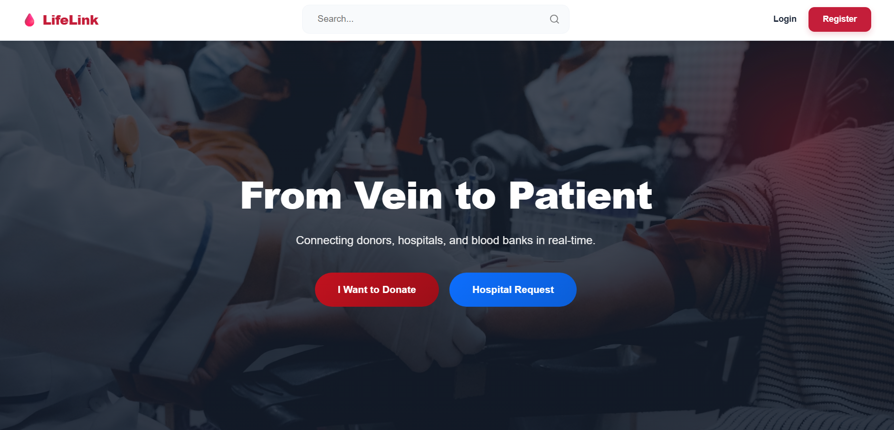

# Project Overview

# 🩸 LifeLink

### Digital Blood Bank & Emergency Donor Network

**LifeLink** is a centralized, web-based **Blood Inventory and Emergency Donor Management System** built to close the critical gap between **blood banks, hospitals, and donors**.
It replaces fragmented, manual record-keeping with a **real-time, PostgreSQL-powered platform** so the right blood type reaches the right patient at the right time.




---

**Hosted at:** [https://lifelink-project.vercel.app](https://lifelink-project.vercel.app)

---

## Key Features

### Administrator Dashboard (Blood Bank Staff)

* **Inventory Management**
  Full CRUD operations on blood units, categorized by blood group, component, and expiry date.
* **Donor Verification**
  Track donor health profiles and enforce the mandatory **90-day donation interval**.
* **Request Approval**
  Approve or deny the blood request made by the hospital and decide which blood bags to send.
  

### Hospital Portal

* **Urgent Blood Requests**
  Submit real-time requirements with blood group and quantity.
* **Live Inventory View**
  Read-only access to current stock for faster emergency coordination.
* **Request Status Tracking**
  Monitor requests from **Pending → Fulfilled**.

### Donor & Public Interface

* **Donor Registration**
  Volunteer signup with contact information and blood group details.
* **Eligibility Checker**
  Automatically calculates the next eligible donation date based on donation history.
* **Donation Appointments**
  Apply for appointment beforehand in the selected donation centres.
---

## Tech Stack:

### Frontend:
- **React (Vite)**
- **Tailwind CSS**
- **Axios**

### Backend:
- **Node.js**
- **Express.js**
- **PostgreSQL**
- **Role-Based Access Control (RBAC)**

### Deployment:
- **Vercel**

---

## 📁 Project Structure

```
LifeLink
├─ api
│  └─ index.js
├─ Backend
│  ├─ package-lock.json
│  ├─ package.json
│  ├─ seed.js
│  └─ src
│     ├─ app.js
│     ├─ config
│     │  └─ db.js
│     ├─ controllers
│     │  ├─ adminController.js
│     │  ├─ authController.js
│     │  ├─ donorController.js
│     │  └─ hospitalController.js
│     ├─ middleware
│     │  └─ authMiddleware.js
│     └─ routes
│        ├─ adminRoutes.js
│        ├─ authRoutes.js
│        ├─ donorRoutes.js
│        └─ hospitalRoutes.js
├─ Database
│  └─ schema.sql
├─ Frontend
│  ├─ eslint.config.js
│  ├─ index.html
│  ├─ package-lock.json
│  ├─ package.json
│  ├─ public
│  │  ├─ favicon.png
│  │  └─ vite.svg
│  ├─ README.md
│  ├─ src
│  │  ├─ App.css
│  │  ├─ App.jsx
│  │  ├─ assets
│  │  │  └─ react.svg
│  │  ├─ index.css
│  │  ├─ main.jsx
│  │  ├─ pages
│  │  │  ├─ admin
│  │  │  │  ├─ AdminDashboard.css
│  │  │  │  ├─ AdminDashboard.jsx
│  │  │  │  ├─ AdminLayout.jsx
│  │  │  │  └─ AdminPage.jsx
│  │  │  ├─ donor
│  │  │  │  ├─ DonationHistory.css
│  │  │  │  ├─ DonationHistory.jsx
│  │  │  │  ├─ DonationMap.jsx
│  │  │  │  ├─ DonationStatus.css
│  │  │  │  ├─ DonationStatus.jsx
│  │  │  │  ├─ DonorDashboard.css
│  │  │  │  ├─ DonorDashboard.jsx
│  │  │  │  ├─ DonorHeader.jsx
│  │  │  │  ├─ DonorProfile.jsx
│  │  │  │  ├─ EditProfileForm.jsx
│  │  │  │  ├─ UpcomingAppointments.css
│  │  │  │  └─ UpcomingAppointments.jsx
│  │  │  ├─ home
│  │  │  │  ├─ HomePage.css
│  │  │  │  └─ HomePage.jsx
│  │  │  ├─ hospital
│  │  │  │  ├─ BloodRequestForm.jsx
│  │  │  │  ├─ HospitalDashboard.css
│  │  │  │  ├─ HospitalDashboard.jsx
│  │  │  │  └─ RequestStatusTable.jsx
│  │  │  ├─ layouts
│  │  │  │  ├─ MainLayout.jsx
│  │  │  │  ├─ Navbar.css
│  │  │  │  └─ Navbar.jsx
│  │  │  └─ login
│  │  │     ├─ LoginPage.css
│  │  │     ├─ LoginPage.jsx
│  │  │     └─ RegisterPage.jsx
│  │  └─ utils
│  │     └─ api.js
│  └─ vite.config.js
├─ package-lock.json
├─ package.json
├─ README.md
├─ vercel.json
└─ Resources
   └─ ER-diagram.png

```

##  Database Schema (ER Diagram)

The system uses a **normalized relational database design** to maintain integrity and scalability.

* **Users**
  * Authentication and Role-Based Access Control (RBAC).
* **Donors & Hospitals**
  * Profile entities linked to user accounts.
* **Inventory & Requests**
  * Connected via a fulfillment bridge for transparent tracking and accountability.
* **Appointments and Donation_Centres**
  * Donation appointment in the selected donation centres.


---

## ⚙️ Installation & Setup

### 1️⃣ Clone the Repository

```bash
git clone https://github.com/coprashant/LifeLink-Project.git
```

### 2️⃣ Backend Setup

```bash
cd Backend
npm install
cp .env.example .env
```

Update your PostgreSQL credentials inside the `.env` file.

### 3️⃣ Database Configuration

* Create a PostgreSQL database named **`Lifelink_db`**
* Run the SQL script located at:

  ```
  ./Database/schema.sql
  ```

### 4️⃣ Run the Application

```bash
npm start
```

---

## 👥 Project Members

| Role     | Name              | GitHub                                       |
| -------- | ----------------- | -------------------------------------------- |
| Frontend | Birendra Rawat    | [@Biren26](https://github.com/Biren26)       |
| Backend  | Prasant Bhattarai | [@coprashant](https://github.com/coprashant) |

---


